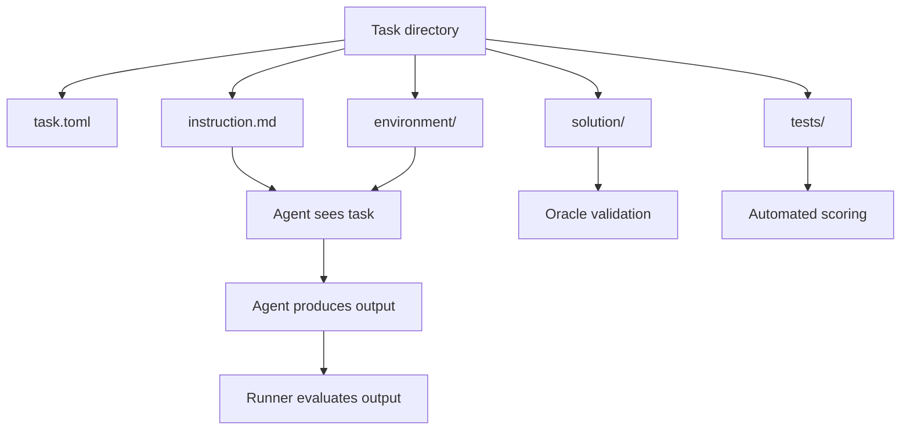

# AgentBench

AgentBench is a reliability-first benchmark for AI agents.
It measures how well agents solve real tasks in isolated environments, with an emphasis on consistency, reproducibility, and benchmark health, not just a single successful run.

The repository also includes a public-facing landing page in [landing/](landing/) that explains the project and its evaluation philosophy.

## What AgentBench Is For

Traditional benchmarks often ask whether an agent can solve a task once. AgentBench is designed to answer a harder question: can the same agent solve it reliably, across repeated runs, in a controlled environment?

The benchmark is built around tasks that look like real terminal or filesystem work. Each task has clear instructions, hidden reference material, automated tests, and a reference solution for validation.

## Current State

This repository is in active development. The current foundation includes:

- A Python task model layer in [runner/](runner/)
- A task discovery and loading system
- A sample benchmark task in [tasks/find-database-files/](tasks/find-database-files/)
- Unit tests for the core Python code in [tests/](tests/)
- A Next.js landing page in [landing/](landing/)
- A set of learning and planning docs under [learning/](learning/) and [docs~/](docs~)

## How It Works



Each task lives in its own folder and follows the same structure:

- `task.toml` for metadata and configuration
- `instruction.md` for the instructions the agent sees
- `environment/` for the files the agent can work with
- `solution/` for the reference implementation
- `tests/` for the evaluation harness

From the agent's perspective, only `instruction.md` and `environment/` are visible.

## Repository Layout

- [runner/](runner/) - Python models, logging, and task loading
- [tasks/](tasks/) - Benchmark tasks and task environments
- [tests/](tests/) - Unit tests for the Python core
- [landing/](landing/) - Next.js landing page
- [learning/](learning/) - Guided walkthroughs, summaries, and prep notes
- [docs~/](docs~) - Planning and specification notes
- [IMPLEMENTATION-PLAN.md](IMPLEMENTATION-PLAN.md) - Long-form build plan

## Example Task

The repository includes a sample task at [tasks/find-database-files/](tasks/find-database-files/).
It asks an agent to find files containing a target word, sort the matches, and write the result in the required format.

That task demonstrates the benchmark pattern:

1. A clear, constrained instruction
2. A small, deterministic environment
3. A hidden reference solution
4. Automated tests that check the agent output

## Getting Started

### Python benchmark core

The Python package is configured from the repository root. Install dependencies and run the tests from there.

```bash
pip install -e .
pytest tests -v
```

### Landing page

The marketing site lives in `landing/` and runs independently.

```bash
cd landing
npm install
npm run dev
```

Open the local URL shown in the terminal to view the site.

## Task Format

A valid task directory contains:

```text
task-id/
├── task.toml
├── instruction.md
├── environment/
├── solution/
└── tests/
```

The task schema is documented in [docs~/task-spec.md](docs~/task-spec.md).

### Task metadata

The core metadata model includes fields such as:

- `id`
- `name`
- `category`
- `difficulty`
- `version`
- `timeout`
- `docker_image`
- `expected_output_files`

## Status Snapshot

The current foundation focuses on the first layer of the system:

- Task schema and validation
- Task discovery and loading
- Sample task content and evaluation files
- Learning docs for the build process
- Landing page copy that frames the benchmark clearly for visitors

Later phases are planned for Docker execution, CLI tooling, repeated evaluation, replay traces, storage, and dashboarding.

## License

MIT
