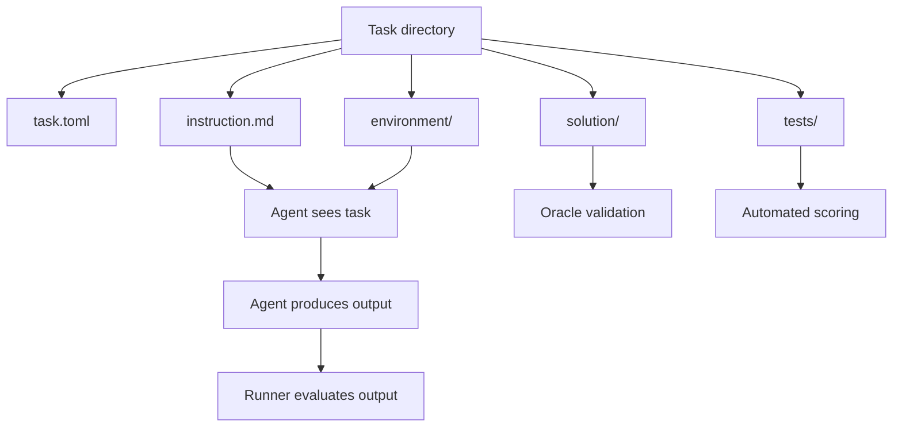
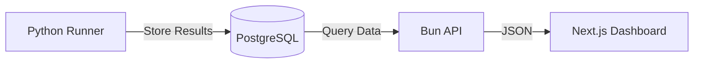

# AgentBench

AgentBench is a reliability-first benchmark for AI agents.
It measures how well agents solve real tasks in isolated environments, with an emphasis on consistency, reproducibility, and benchmark health, not just a single successful run.

The repository also includes a public-facing landing page in [landing/](landing/) that explains the project and its evaluation philosophy.

## What AgentBench Is For

Traditional benchmarks often ask whether an agent can solve a task once. AgentBench is designed to answer a harder question: can the same agent solve it reliably, across repeated runs, in a controlled environment?

The benchmark is built around tasks that look like real terminal or filesystem work. Each task has clear instructions, hidden reference material, automated tests, and a reference solution for validation.

## Current State

This repository is in active development. The current foundation includes:

- A Python task model layer in [runner/](runner/)
- A task discovery and loading system
- A sample benchmark task in [tasks/find-database-files/](tasks/find-database-files/)
- Unit tests for the core Python code in [tests/](tests/)
- A Next.js landing page in [landing/](landing/)
- A set of learning and planning docs under [learning/](learning/) and [docs~/](docs~)
- **PostgreSQL database integration** for storing benchmark results and analytics
- **Dashboard and API** for visualizing benchmark data and task health

## How It Works


```mermaid
flowchart TD
    A[Task directory] --> B[task.toml]
    A --> C[instruction.md]
    A --> D[environment/]
    A --> E[solution/]
    A --> F[tests/]
    C --> G[Agent sees task]
    D --> G
    G --> H[Agent produces output]
    H --> I[Runner evaluates output]
    E --> J[Oracle validation]
    F --> K[Automated scoring]
```

Each task lives in its own folder and follows the same structure:

- `task.toml` for metadata and configuration
- `instruction.md` for the instructions the agent sees
- `environment/` for the files the agent can work with
- `solution/` for the reference implementation
- `tests/` for the evaluation harness

From the agent's perspective, only `instruction.md` and `environment/` are visible.

## Repository Layout

- [runner/](runner/) - Python models, storage layer, and task loading
- [tasks/](tasks/) - Benchmark tasks and task environments
- [tests/](tests/) - Unit tests for the Python core
- [dashboard/](dashboard/) - Next.js dashboard and Bun API backend
- [landing/](landing/) - Next.js landing page
- [docs/](docs/) - Database setup, operations, and migration guides
- [scripts/](scripts/) - Utility scripts for database management
- [learning/](learning/) - Guided walkthroughs, summaries, and prep notes
- [docs~/](docs~) - Planning and specification notes
- [IMPLEMENTATION-PLAN.md](IMPLEMENTATION-PLAN.md) - Long-form build plan

## Example Task

The repository includes a sample task at [tasks/find-database-files/](tasks/find-database-files/).
It asks an agent to find files containing a target word, sort the matches, and write the result in the required format.

That task demonstrates the benchmark pattern:

1. A clear, constrained instruction
2. A small, deterministic environment
3. A hidden reference solution
4. Automated tests that check the agent output

## Getting Started

### 1. Database Setup

AgentBench stores benchmark results in PostgreSQL. Follow the [Database Setup Guide](docs/DATABASE-SETUP.md) for complete instructions.

**Quick Start**:

```cmd
# Copy environment template
copy .env.example .env

# Start PostgreSQL database (Docker required)
docker compose up -d postgres

# Verify setup
python scripts\test-connection.py
```

The database auto-initializes with the schema on first startup. See [DATABASE-SETUP.md](docs/DATABASE-SETUP.md) for detailed setup, configuration, and troubleshooting.

### 2. Python Benchmark Core

Install dependencies and run tests:

```bash
pip install -e .
pytest tests -v
```

### 3. Run a Benchmark

Run a benchmark task with database storage:

```bash
agentbench bench find-database-files --agent openai --model gpt-4 --runs 10
```

Results are automatically stored in PostgreSQL. See [DATABASE-OPERATIONS.md](docs/DATABASE-OPERATIONS.md) for more operations.

### 4. View Results (Dashboard)

Start the API backend and web dashboard:

```bash
# Terminal 1: Start API
cd dashboard\api
bun install
bun run src/index.ts

# Terminal 2: Start web frontend
cd dashboard\web
bun install
bun run dev
```

Open http://localhost:3000 to view benchmark results, task health, and agent leaderboards.

### 5. Landing Page (Optional)

The marketing site lives in `landing/` and runs independently:

```bash
cd landing
npm install
npm run dev
```

Open the local URL shown in the terminal to view the site.

## Task Format

A valid task directory contains:

```text
task-id/
├── task.toml
├── instruction.md
├── environment/
├── solution/
└── tests/
```

The task schema is documented in [docs~/task-spec.md](docs~/task-spec.md).

### Task metadata

The core metadata model includes fields such as:

- `id`
- `name`
- `category`
- `difficulty`
- `version`
- `timeout`
- `docker_image`
- `expected_output_files`

## Database and Storage

AgentBench uses **PostgreSQL 16** for storing benchmark results, enabling:

- **Persistent storage**: All benchmark runs, results, and metrics stored in database
- **Rich analytics**: Query runs, aggregate statistics, compute success rates
- **Task health monitoring**: Automatic classification of task reliability
- **Dashboard visualization**: Web UI for exploring results and trends
- **API access**: REST API for programmatic data access

### Quick Database Operations

```cmd
# Start database
scripts\start-db.cmd

# Stop database
scripts\stop-db.cmd

# Backup database
scripts\backup-db.cmd

# Reset database (WARNING: deletes all data)
scripts\reset-db.cmd

# Seed sample data for testing
python scripts\seed-sample-data.py --runs 10 --clean
```

### Documentation

- **[DATABASE-SETUP.md](docs/DATABASE-SETUP.md)** - Complete setup guide with prerequisites and troubleshooting
- **[DATABASE-OPERATIONS.md](docs/DATABASE-OPERATIONS.md)** - Daily operations, backup/restore, maintenance
- **[MIGRATION-GUIDE.md](docs/MIGRATION-GUIDE.md)** - Migrate from file-based to database storage

### Architecture


```mermaid
graph LR
    CLI[Python Runner] --> |Store Results| DB[(PostgreSQL)]
    DB --> |Query Data| API[Bun API]
    API --> |JSON| WEB[Next.js Dashboard]
```

The system supports **dual storage**: automatic fallback to file-based storage if database is unavailable.

## License

MIT
